# Stock Market Data Analysis (1962-2020)

## Project Overview

This project focused on the statistical and econometric analysis of stock market data.
The goal is to examine return behavior, volatility patterns, and relationships between trading activity and price dynamics.


## Installation
1. Clone the repository
2. Install dependencies:
   ```bash
   pip install -r requirements.txt
---

## Dataset

SOURCE: https://www.kaggle.com/datasets/jacksoncrow/stock-market-dataset

- Historical stock data (OHLCV)
- All NASDAQ tickers
- Time period: 1962-2021

---

## Data Integration
- Raw data was merged into one csv file
- Also created test dataset with date filtration starting from 2019 to speed up and simplify the process. 

## Data Cleaning

The dataset was preprocessed to ensure data quality

### Date
- Standardized date column

### Filtration
- After reviewing the data, I found that the stocks had different listing dates. 
- I decided to shorten the sample period so that it starts from 2000-01-01 to ensure data consistency across the modern market era.

### Missing Values
- Removed 462 rows with missing values

### Duplicates
- All duplicate rows were removed

### Logical Consistency Check
- Removed invalid rows where:
  - High < Low
  - High < Close
  - Low > Close
  - Volume < 0

### Invalid Prices
- A significant number of records had invalid Open prices equal to zero.
- It has been treated as missing values and removed to ensure data integrity.

### Conclusion:
- At the end dataset contains 18371813 records.
- It is consistent and ready to be analyzed.
---

## Feature Engineering

The following variables were calculated:

- Returns 
- Log Returns
- Rolling Standard Deviation of Returns
- Moving Averages (SMA 10, SMA 50)
- Momentum (10-day return)
- Volume change
- Target (variable was defined as the next-day return to support predictive modeling) 

---

# Exploratory Data Analysis (EDA)

Two levels of analysis were defined: market level and stock level.

## Market Level

### Records Distribution
- Distribution is strongly left-skewed.
- A large proportion of stocks have observations covering nearly the entire time period.
- However, some stocks have significantly fewer data points due to later listing dates.

### Returns Distribution
- Returns are strongly centered around zero, indicating that most daily price changes are small.
- The distribution is centered around zero but deviates from normality due to the presence of fat tails.
- The distribution appears approximately symmetric.

### Volatility Distribution
- Volatility is strongly right-skewed.
- Most observations correspond to low-volatility periods, while a smaller number of observations represent higher volatility levels.

### Correlation Structure
- Stocks exhibit moderate positive correlation (around 0.3 on average).
- However, correlations are far from perfect, suggesting the presence of common market factors.

## Stock Level

### Price Behavior
- Most stocks exhibit long-term trends combined with short-term fluctuations.
- While many stocks show upward trends, some display significant declines or unstable behavior.

### Returns Behavior
- Returns fluctuate around zero and appear largely random across different stocks.

### Volatility Behavior
- Some evidence of volatility clustering is observed, where periods of higher volatility tend to persist.

### Moving Average (SMA)
- The moving average closely follows the price, smoothing short-term noise without altering the overall trend.

### Autocorrelation (ACF)
- Autocorrelation is generally close to zero, with only small deviations at a few lags.
- This suggests weak predictability of returns.

## Data Structure
- Most stocks have a large number of observations close to the maximum available.
- However, some stocks have significantly fewer data points due to later listing dates.
- To ensure data reliability, stocks with fewer than 500 observations were removed.


# Model Creating

- The goal of this section is to test the Efficient Market Hypothesis and examine whether stock behavior is predictable.

## Ordinary Least Squares (OLS Model)

The purpose of this section is to test whether simple linear relationships can predict future stock returns.

Three models were estimated using OLS with robust standard errors '**HC3**'.

**Method**
- Data was sorted by ticker and date.
- Removed stocks with less than 500 records to avoid data distortion and errors.
- Created lagged variables: Return_lag1 and Volume_lag1
- Removed missing values generated after creating lagged variables
- Train/Test split:
   - Train: before 2019
   - Test: starting with 2019
- Used robust standard errors (HC3)

### Model 1 - Lagged Returns
Return(t) = β0 + β1 * Return(t-1) + ε

(This model tests whether past returns can predict future returns)

---

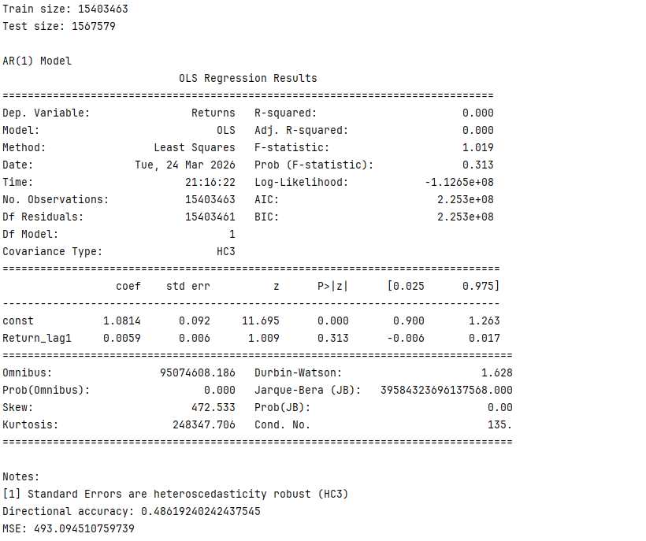

---

**Interpretation**:
- The coefficient is not statistically significant and very close to zero. 
- This indicates that past returns do not predict future returns.
- No evidence of momentum
- No evidence of mean reversion

### Model 2 - Lagged Volume
Return(t) = β0 + β1 * Volume(t-1) + ε

(This model tests whether volume change can predict future returns)

---

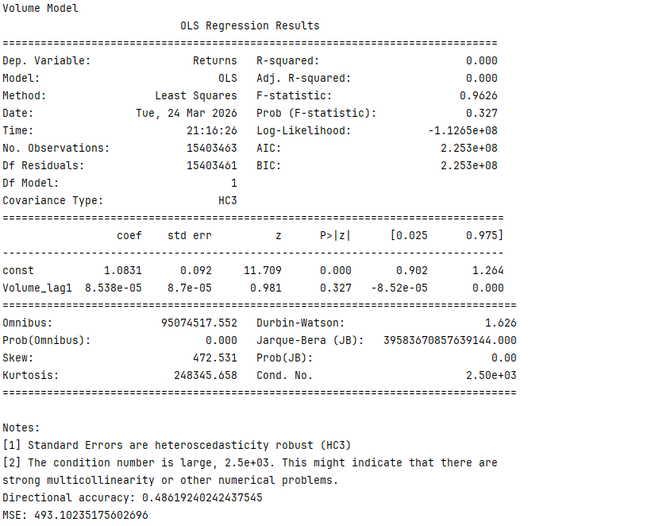

---

**Interpretation**:
- Volume change does not provide predictive power for returns.

### Model 3 – Combined Model
Return(t) = β0 + β1 * Return(t-1) + β2 * Volume(t-1) + ε

(This model tests whether both return and volume change can predict future returns)

---

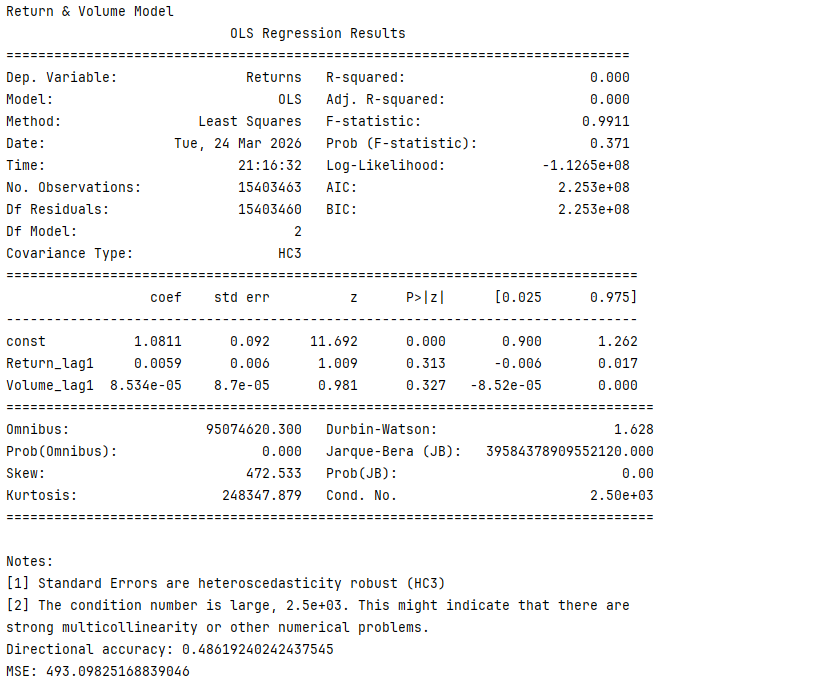

---

**Interpretation**:
- Combining two variables didn't improve the model.
- Model can't predict future returns.

## Conclusion:
All three models provide consistent results:

 - Near-zero explanatory power.
 - No statistically significant predictors.
 - No improvement across different model specifications.

**Financial Insight**:
- The results support the weak form of the Efficient Market Hypothesis (historical price and volume information cannot be used to predict future returns).
- It is unlikely to build a profitable strategy based on this model.


## ARIMA model

The purpose of this section is to test whether time series structure in returns can predict future returns.

### Model specification:
   ARIMA (1,0,0)
   - AR(1): LAG RETURNS
   - d = 0: variable is already stationary
   - MA = 0: no moving averages

**Method**
- Data was sorted by ticker and date.
- Removed stocks with less than 1000 records to ensure model stability.
- Train/Test split:
   - Train: before 2019
   - Test: starting with 2019
- Model was estimated separately for each stock.
- Random sample of 10 tickers was used.

---


---

**Interpretation**:
- Most coefficients are statistically significant (p < 0.05), but their values are very small.
- This means past returns have only a weak effect on future returns.
- Directional accuracy is around 0.5, so the model predicts almost like random guessing.
- Results also vary across stocks, indicating low stability.


**Financial Insight**:
- The results support the weak form of the Efficient Market Hypothesis
- It is unlikely to build a profitable strategy based on this model.


## GARCH Model

The purpose of this section is to model and predict volatility of stock returns.

Unlike previous models, this approach focuses on volatility instead of returns.

**Hypothesis:**

Stock return volatility exhibits clustering and can be modeled using GARCH-type models.

### GRID COMPARISON
GRID mode was used to compare different volatility models and select the most suitable specification.

**Models tested:**
 - GARCH
 - EGARCH
 - APARCH

**Parameters tested:**
  - (1,1)
  - (1,2)
  - (2,1)

In total, 9 model configurations were evaluated for each stock.

**Results:**
- EGARCH(2,1) was most frequently selected (13 out of 20).
- Selection was based on AIC metric.
- Other models occasionally performed better, but differences were small
- GRID results have been saved as GRID.csv

**Conclusion from GRID Research:**
- EGARCH models are better for asymmetric volatility. 
- EGARCH(2,1) was chosen as the default model for **"FINAL"** analysis

### FINAL Analysis: EGARCH(2,1)
**Method:**
- Data was sorted by ticker and date.
- Stocks with fewer than 500 observations were removed.
- Returns were scaled and clipped to ensure stability.
- Train/Test split:
   - Train: before 2019
   - Test: starting with 2019
- Model was estimated separately for each stock.
- Random sample of 100 tickers was used.
- Models with convergence issues were excluded.
- Parallel computation was used to reduce execution time and improve efficiency.

### Evaluation Metrics:
- MAE - Mean absolute error, the lower - the better.
- Relative MAE - normalized MAE for comparison across stocks.

---

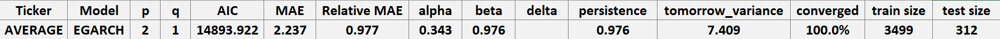

---

### Model Characteristics:
- **Alpha**: Reaction to recent shocks.
- **Beta**: Persistence of past volatility.
- **Persistence**: The sum of these effects. If it's close to 1, the "memory" of a crisis stays for a long time.
  **Results**
- High **Beta** (~0.97–0.99) indicates that volatility is driven more by past volatility than by new shocks.
- Persistence is very high ~ 0.98, indicating that volatility has a long term memory.

### Interpretation:
- The model tends to overestimate volatility, which is consistent with high persistence.
- **Mean Relative MAE** ~ 0.97, meaning that the prediction error is close to the average magnitude of volatility itself.
- This is comparable to a naive baseline where volatility is assumed to remain constant.
- Its predictive performance remains moderate and may not provide a strong advantage:
    - Some stocks have R_MAE ~ 0.65, and it is a good level of prediction and can be used.
    - Others have it ~ 4.6, indicating that model is completely useless for those stocks.
    - About 80% of stocks have R_MAE < 1, indicating that for most stocks the model performs better than a naive prediction.
- **MAE** provides an interpretable measure of prediction error in absolute terms for individual stocks.

---

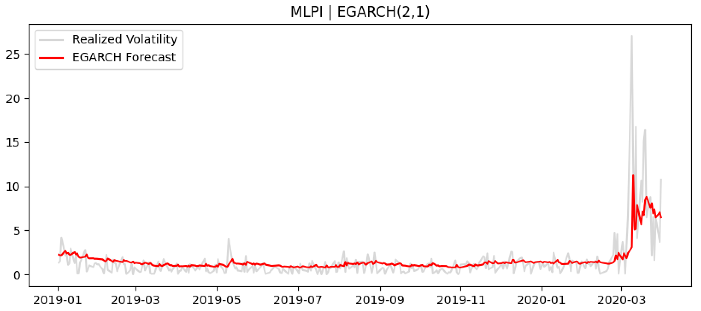

---

### Visual Analysis
- Predicted volatility is smoother than Absolute Returns
- Model reacts to spikes with delay
- Predictions often stay elevated after return decreases

**This results in:**
- Lagging response to market shocks
- Systematic overestimation in low-volatility periods

### Optimization
- During the programming I explored the way to reduce run time and included paralleled calculating.
- I reduced time on about 5%. From 139.22 to 132.61 seconds on a test setup.

### Conclusion
- FINAL results have been saved as FINAL.csv
- EGARCH(2,1) provides stable and consistent results across different stocks.
- Volatility clustering observed during EDA is confirmed by the model results.
- The model reacts to volatility shocks rather than predicting them in advance.
- The model successfully captures persistence in volatility.
- However, predictive performance is not consistent across all stocks:
    - For many stocks, the model performs at a baseline level.
    - For some stocks, it provides significantly better predictions (low R_MAE).
    - For others, it fails to capture volatility dynamics.

- This suggests that the model can be useful, but only for specific assets.

### Financial Insight
- GARCH-type models can be useful for risk management, portfolio allocation, and volatility-based strategies.
- The model is not suitable for predicting sudden volatility spikes, but rather for estimating the general level of risk.

### Limitations
- Model tends to overestimate volatility
- Performance slightly varies across different stocks
- Only a subset of stocks was used due to computational constraints


## Backtest

The goal of that part is to implement EGARCH(2,1) model into four strategies, choose the best one for further improving. 

### Strategies Comparison

**Method**
- Gets trained models for chosen list of stock from last iteration in "GARCH" script.
- Tickers list =  [AAPL, GILD, GOOGL, MSFT, AMZN, MLPI, PEP, COST, CSCO, AMGN]
- Selected stocks are liquid large-cap equities with sufficient historical data and low Relative MAE: (0.65–0.86).
- Evaluates 5 strategies:
    - [1] "Buy & Hold" as a baseline for other strategies.
    - [2] "Target Volatility Scaling (TVS)". Uses constant volatility equal 2% to change size of the position.
    - [3] "Volatility Filter". Has two conditions - in/out of the market. Effected by MA_50 of volatility.
    - [4] "Volatility Ratio". Uses MA_20 of volatility as a target to change size of the position. (dynamic TVS)
    - [5] "TVS + Momentum Filter". Combines basic TVS and 20 days momentum of returns as a Filter with two conditions.
- Used no leverage to make equal conditions. 

**Evaluation Metrics**
- Matrix:
    - Correlation matrix of used stocks to check if they are not too tight connected. Returns used as a values.
    - Average Correlation - average values of all values excluding diagonal ones.
  - Average Performance of Strategies:
      - Total Return - basic metric to grade the efficiency of strategy.
      - Sharpe - return/risk
      - Max Drawdown - shows how strategy managed with declines.
      - Annual Volatility - shows how strategy reduces overall volatility.
      - Hit Ratio - probability for strategy to have profitable daily return.
      - Outperformance (vs B&H) - (Sharp of strategy > Sharpe of baseline).

**Graphics**
- For each ticker, the backtest generates four comprehensive plots:
    - Equity Curve: Visualizes cumulative returns and overall capital appreciation over the testing period.
    - Drawdown Analysis: Evaluates risk resilience by showing how each strategy navigates and recovers from market declines.
    - Dynamic Exposure (Position Sizing): Displays the evolving leverage for continuous scaling strategies (2 & 4). Note: Binary filters (3 & 5) are excluded from this plot due to their 0/1 step-function nature.
    - Volatility Diagnostics: Compares GARCH-predicted volatility (red) against realized absolute returns (gray) to assess model accuracy and responsiveness.

---

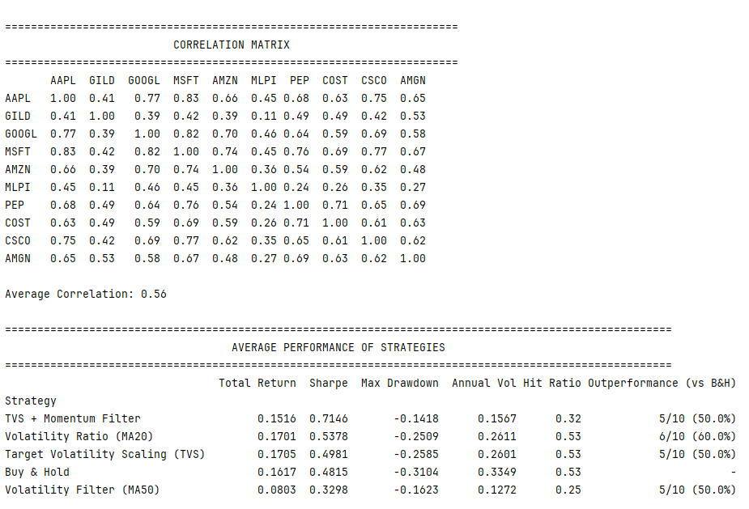

---

### Interpretation
- Matrix shows that stocks have median correlation. They don't behave like one, but have same trend.  
- That means further strategies comparison can be proceeded. 
- Strategies:
  - "TVS + Momentum Filter" achieved the highest Sharpe ratio (0.71) and lowest drawdown (-14%), indicating strong risk-adjusted performance.
  - However, it outperforms Buy & Hold only in 50% of cases, suggesting instability across assets.
  - Volatility Ratio (MA20) shows the most consistent performance (60% outperformance), acting as a stable dynamic allocation strategy.
  - Target Volatility Scaling (TVS) reduces volatility and slightly improves return.
  - Volatility Filter (MA50) significantly reduces drawdowns but sacrifices returns.

---

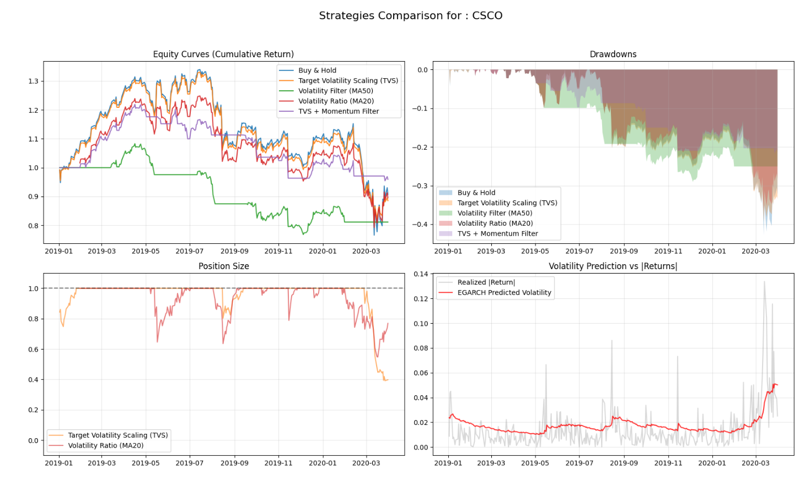

---

### Visual Analysis
- Equity curves show that volatility-based strategies generally reduce drawdown compared to Buy & Hold.
- TVS + Momentum Filter produces smoother performance, but may lag during strong upward trends.
- Volatility Filter avoids large losses but often remains out of the market for extended periods.
- Dynamic position sizing (TVS, Volatility Ratio) adjusts exposure effectively during high volatility regimes.
- EGARCH volatility forecasts capture volatility clustering and react to market stress periods.


### Conclusion
- Volatility-based strategies improve risk-adjusted performance compared to Buy & Hold.
- The combination of volatility targeting and momentum filtering consistently delivers superior results across assets.
- TVS + Momentum Filter achieves the highest Sharpe ratio and strong return while maintaining controlled drawdowns.
- It also demonstrates stable outperformance across the majority of tickers.
- Based on the results, **Target Volatility Scaling (TVS)** was selected as the foundation for further development due to its theoretical clarity and strong risk-adjusted characteristics.


## "Target Volatility Scaling (TVS)" improvement Backtest

-The goal of that part is to improve TVS strategy to level where it shows better performance in risk managing than other strategies.

-Decided to grade strategy by comparison with two other strategies: Buy & Hold, TVS (without improvements, only additional costs) 

### Periods Setup
- To test robustness and sensitivity strain/test split date from previous part has been improved.
- Now there are 23 Periods starting 2007-06-01 and with a gap 6 months, with a duration of two years.
- For "3 PERIODS ANALYSIS" I took: 
    - 2007-06 - 2009-06 for it's crysis with a high volatility.
    - 2015-06 - 2017-06 as a period of growth, to see strategy in opposite situation.
    - 2018-06 - 2020-04 for growth in falling periods in one. (2000-04-01 is the last date in Dataset)
- To calculate second table and all plots, all periods been used.

### Model Improvements

**"Buy & Hold"**
- 0.05% commission for first and last day. Needed to recreate real trading conditions.

**TVS with transaction and margin costs**
- Target volatility = 2%
- Transaction costs = 0.05%
- Leverage margin costs = 5% annually
- Leverage from 0 to 2

**Target Volatility Scaling Advanced**

- Basic Costs:
    - Transaction costs = 0.05%
    - Leverage margin costs = 5% annually
    - Leverage from 0 to 2
- Advanced:
    - Limited volatility floor to 1.2%
    - Symmetric target - SMA_100 of volatility
    - Volatility Risk Premium Offset - discount equal to 1
    - Rebalancing Threshold (Only update position if the change is greater than 5% )
    - Drawdown Protection - If drawdown more that 10% , then cut position in half.


- Also **Asymmetric Target** based on SMA(prices) has been tested. It did not give any advantage, so it was removed.

### Evaluation Metrics

- Average Performance of Strategies:
    - Total Return
    - Sharpe
    - Max Drawdown 
    - Annual Volatility
    - Hit Ratio - probability for strategy to have profitable daily return.
    - Turnover - the annual rate at which positions are traded or replaced.
    - CVaR - Conditional Value at Risk   
    - RMSE_Vol - Volatility Target Deviation 
    - TRR - Tail Risk Reduction Ratio  
    - Outperformance (vs B&H) - (Sharp of strategy > Sharpe of baseline).


---

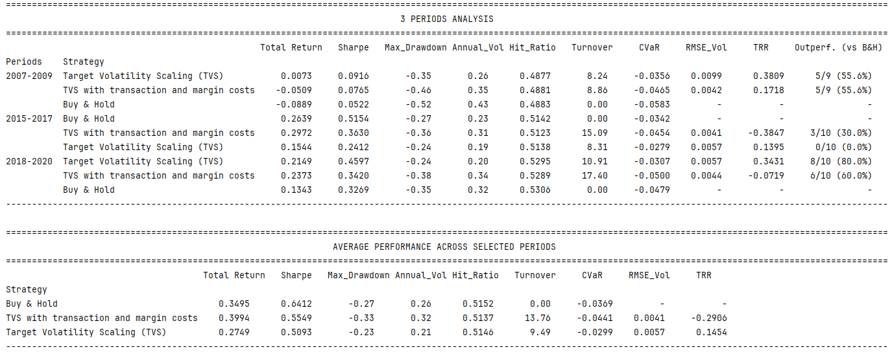

---


### Interpretation

- Some metrics show same pattern across all analysis: 
    - Advanced TVS has lower Turnover comparing to Basic TVS, meaning it changes leverage smarter.
    - Advanced TVS consistently improves tail risk (CVaR), reducing extreme losses compared to both Buy & Hold and basic TVS.
    - Advanced TVS always improves TRR (additional metric for CVaR), meaning It better manages  sudden declines in all periods especially during crisis periods.
    - Advanced TVS significantly decreases max_drawdowns and volatility, fulfilling its main goal - managing risks.  


**3 PERIODS ANALYSIS:**

- 2007-2009
    - TVS_Advanced shows better metrics results than other strategies.
    - Even return is positive.
    - Buy & Hold is the worst strategy.
- 2015-2017
    - Buy & Hold has the best Sharpe ratio.
    - At first glance it may seem that TVS Basic is better that Advanced ,but it has high turnover meaning it overtrading. And with very high risks.
    - Advanced TVS is the most stable in risks, despite it has lower returns.
- 2018-2020
    - Bets period for Advanced TVS. Highest Sharpe, lowest risks(low volatility and drawdowns) and better position managing(low turnover).
    - Basic TVS also is better in return and Sharpe than B&H , but has worse risk measuring metrics.


**AVERAGE PERFORMANCE ACROSS SELECTED PERIODS:**
- Advanced TVS has lower return and  Sharpe, with better results in risk managing.
- That table represents average across 23-year period, so it contained rises and declines.


**Analysis Conclusion:**
- TVS Advanced demonstrates superior risk management by significantly decreasing maximal drawdowns and volatility compared to both Buy & Hold and basic TVS.
- The strategy produces lower absolute returns but offers much more stable, less volatile growth, making it an ideal fit for crisis periods.
- By using a dynamic leverage and rebalancing threshold, the strategy adapts to market conditions "smarter" than the basic version, resulting in lower costs and better tail-risk protection.
- The strategy passes robustness checks, showing stable performance across different market regimes and parameter settings, indicating no significant overfitting.

### Visualisation

**Graphics**
- GLOBAL STRATEGY ROBUSTNESS ANALYSIS (2007-2020):
    - Sharp Ration dynamics
    - Max Drawdown per period
    - Total Return per period
    - Average Equity Curve


- LEVERAGE DISTRIBUTION


- SENSITIVITY ANALYSIS: RISK & PERFORMANCE HEATMAPS:
    - Mean Sharpe Ratio (Efficiency
    - Mean CVaR (Tail Risk)
    - Mean Total Return (Performance)
    - Std Dev of Sharpe (Stability)

**Sensitivity Setup:**
- Rebalance values [0.02, 0.03, 0.04, 0.05]
- Volatility discount [0.6, 0.8, 1.0]
- 12 different combinations.

---

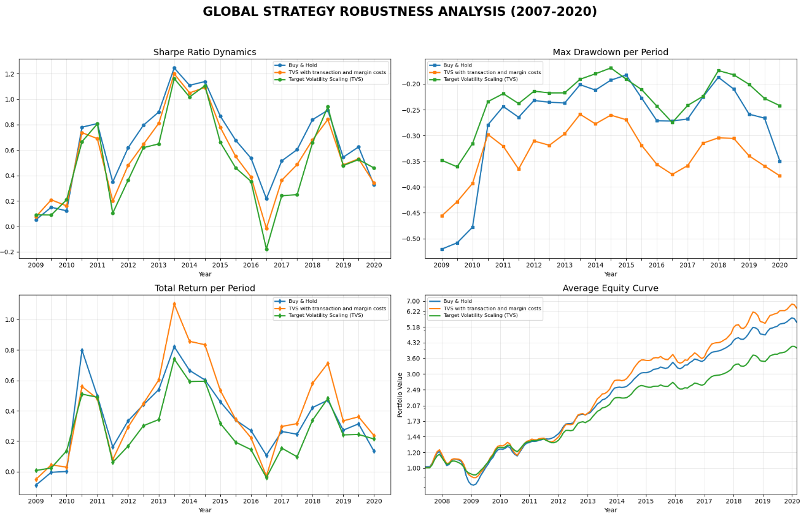

---

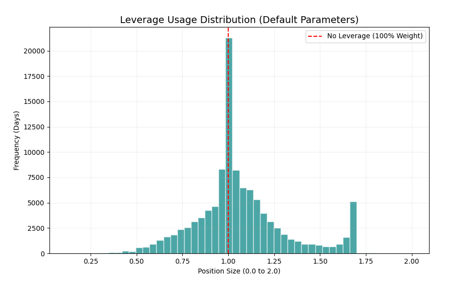

---

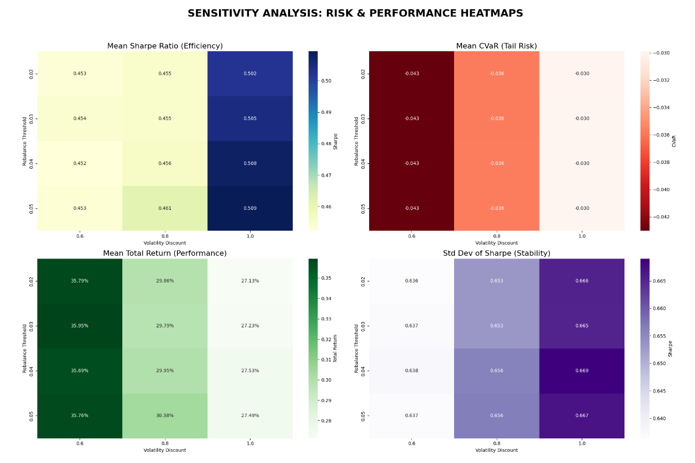

---


### Plots interpretation

The goal of this analysis was to ensure that the strategy's performance is not a result of "overfitting" or "lucky" parameter selection. A robust strategy should show stable behavior even when its core inputs are slightly modified.


GLOBAL STRATEGY ROBUSTNESS ANALYSIS (2007-2020)
- Sharpe Ratio Dynamics:  Advanced TVS shows more stability across periods, while Buy & Hold fluctuates heavily.
- Max Drawdown: TVS strategies consistently reduce drawdowns, especially during crisis periods.Advanced version has the best results. 
- Total Return: Buy & Hold and TVS_Basic dominate in strong bull markets. In 2009 and 2020 TVS Advanced shows high return.
- Average Equity Curve: Advanced TVS produces smoother growth with fewer sharp drops.


LEVERAGE DISTRIBUTION:
- Due to floor = 0.12 for volatility, max leverage becomes 1.(66) and not 2.
- During programming has been tested different leverages, and that exact setup is the most profitable and stable.
- The highest frequency occurs at 1.0x leverage. 
- This is the result of the Rebalancing Threshold (5%), which prevents unnecessary turnover by keeping the position at 100% weight unless volatility shifts significantly.
- Right-Skewed Tail: The distribution exhibits a positive skew (right tail) extending from 1.0 to 1.66. This represents systematic scaling during low-volatility regimes to maintain the risk target.
- The lack of a "fat" left tail (positions < 0.5) indicates that the strategy rarely sits in deep cash, preferring to stay fully invested.


SENSITIVITY ANALYSIS: RISK & PERFORMANCE HEATMAPS:

Changing rebalance shows not much difference, only small error.

- Mean Sharpe Ratio: Increasing discount value slightly increases Sharpe.
- Mean CVaR: Increasing discount value increases CVaR value. 
- Mean Total Return: Increasing discount value reduces Return by ~8%.
- Std Dev of Sharpe: Increasing discount value slightly increases Sharpe deviation.

**Plots Conclusion:**
- TVS Advanced shows best results in risk managing by decreasing maximal drawdowns and volatility.
- It produces less return, but with less volatile growth. Best fit for crisis periods.
- Strategy smoothly changes position depending on market condition by using leverage.
- Optimum parameters for rebalance and discount are 0.05 and 1. It was chosen as a default setup for strategy.
- The TVS Advanced strategy successfully passed the sensitivity test. The performance metrics change smoothly and predictably across the parameter grid rather than showing "random" peaks.


### TVS Advanced Conclusion

- The Advanced TVS framework improves the original strategy by introducing adaptive risk controls, resulting in consistently lower drawdowns, volatility, and tail risk across all tested market regimes.
- While the strategy sacrifices part of upside performance during strong bull markets, it delivers a significantly smoother and more stable return profile.
- The inclusion of rebalancing thresholds and drawdown-based risk control reduces unnecessary turnover and improves capital efficiency.
- Robustness and sensitivity tests confirm that the results are stable across different parameter configurations, indicating that the performance is structural rather than driven by overfitting.


**Financial Insight**
- The results highlight a fundamental trade-off between return maximization and risk control: strategies that maximize exposure (e.g., Buy & Hold or basic TVS) tend to outperform during bull markets but are highly vulnerable to drawdowns and tail events.
- In contrast, volatility-managed strategies like Advanced TVS act as a dynamic risk overlay, adjusting exposure in response to changing market conditions and stabilizing the return distribution.
- From a portfolio construction perspective, this type of strategy is not necessarily designed to outperform in absolute terms, but to improve risk-adjusted performance and reduce downside convexity.
- This makes Advanced TVS particularly relevant for:
  - risk-constrained portfolios
  - capital preservation mandates
  - multi-asset allocation frameworks as a volatility stabilizer


**Key takeaway:**

Volatility targeting does not necessarily maximize returns, but it improves the stability, predictability, and downside protection of returns — which is often more valuable than raw performance in professional portfolio management.


